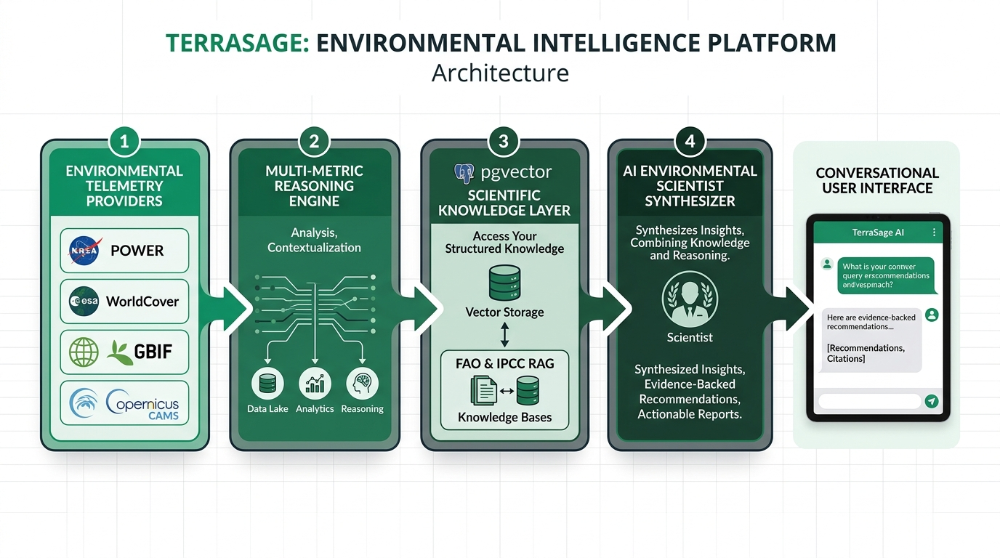

# TerraSage — AI Biodiversity Intelligence System
### Darukaa.Earth AI Biodiversity Intelligence Chatbot Challenge

TerraSage is an AI-powered conversational environmental intelligence platform designed to behave like an **AI Environmental Scientist**, not a generic chatbot. Grounded in **5 telemetry layers** (Soil, Climate, Land Cover, Biodiversity, Human Impact), a **535-chunk pgvector scientific RAG layer** (FAO, IPCC), **multi-variable mathematical reasoning** (≥3 cross-domain variables), and evidence-backed ecological restoration recommendations.

---

## 🔗 Official Submission Links
- **GitHub Repository**: [https://github.com/Farheenaiml/TerraSage](https://github.com/Farheenaiml/TerraSage)
- **Live Cloud Application**: [https://terrasage-frontend.onrender.com](https://terrasage-frontend.onrender.com)
- **Live Interactive API Documentation (Swagger)**: [https://terrasage-backend.onrender.com/docs](https://terrasage-backend.onrender.com/docs)
- **Official Word Submission Document (.docx)**: [`docs/TerraSage_Darukaa_Submission.docx`](docs/TerraSage_Darukaa_Submission.docx)

---

## 🏛️ System Architecture & Information Pipeline

<p align="center">
  
</p>

```
[User Inquiry / Site Coordinates]
            |
            v
+-------------------------------------------------------------------+
|                  Conversational Context Engine                    |
|  - Extracts location, coordinates, crop, land use, SOC            |
|  - Triggers clarification questions if context is lacking (< 3)  |
|  - Maintains multi-turn conversation memory (HUD Known/Missing)   |
+---------------------------------+---------------------------------+
                                  |
                                  v
+-------------------------------------------------------------------+
|               Multi-Domain Telemetry & RAG Pipeline               |
|  - SoilGrids (Soil Health: pH, SOC, Bulk Density)                 |
|  - NASA POWER (Agroclimatology: Temp, Precipitation, Solar)       |
|  - ESA WorldCover (10m Sentinel-2 Land Classification)            |
|  - GBIF API (Biodiversity Occurrences & Native Species Count)     |
|  - Copernicus CAMS / Open-Meteo (PM2.5, PM10, AQI, Impact)        |
|  - pgvector RAG (535 Scientific Chunks: FAO & IPCC Literature)    |
+---------------------------------+---------------------------------+
                                  |
                                  v
+-------------------------------------------------------------------+
|                 Multi-Variable Reasoning Subsystem                |
|  - Validates interaction across >= 3 variables                    |
|  - Evaluates ecological trade-offs (e.g., SOC vs. Aridity)        |
|  - Enforces scientific confidence scores (0.00 - 1.00)            |
+---------------------------------+---------------------------------+
                                  |
                                  v
+-------------------------------------------------------------------+
|                     AI Synthesis & Action Engine                  |
|  - Ultra-fast Groq Llama 3.3 / GPT-OSS or Fallback Scientist v1   |
|  - Generates verifiable citations [Author, Year, Findings]        |
|  - Emits structured actionable recommendations (Target: +15-25%)  |
+---------------------------------+---------------------------------+
                                  |
                                  v
[Frontend HUD: Live Environmental Telemetry & Scientific Chat Stream]
```

---

## 🌿 The Five Telemetry Layers

| Telemetry Layer | Provider & Source | Extracted Parameters | Ecological Purpose |
|:---|:---|:---|:---|
| **1. Soil Health** | ISRIC SoilGrids REST API (v2.0) | Soil Organic Carbon (SOC cg/kg), Soil pH, Bulk Density (cg/cm³), CEC | Determines microbial substrate availability, root impedance, and baseline nutrient retention. |
| **2. Climatology** | NASA POWER Agroclimatology API | Mean Annual Precipitation (mm/year), Temperature (°C), Solar Insolation | Governs photosynthetic potential, drought stress risk, and species climatic envelopes. |
| **3. Land Cover** | ESA WorldCover 10m Sentinel-2 | Canopy cover percentage, land classification code (cropland, tree cover, bare ground) | Identifies habitat fragmentation, tree loss trajectory, and vegetative buffer deficits. |
| **4. Biodiversity** | GBIF Occurrence API | Native species count, invasive occurrences, endangered taxa counts | Establishes biological baseline and targets for native flora/fauna recruitment. |
| **5. Human Impact** | Copernicus CAMS / Open-Meteo | PM2.5 (μg/m³), PM10, Nitrogen Dioxide (NO₂), European Air Quality Index (AQI) | Assesses anthropogenic stressors, atmospheric nitrogen deposition, and smoke exposure. |

---

## 🗄️ Database Architecture & Vector Schema

The persistent storage engine is **PostgreSQL 16** with native **`pgvector`** extension support:

- **`documents` & `document_chunks`**: Stores 535 ingested research chunks from FAO and IPCC with 384-dimensional dense vector embeddings, document metadata, section headers, and authoring organizations.
- **`environmental_observations`**: Normalized time-series satellite and sensor telemetry (SoilGrids, NASA, ESA, GBIF, Copernicus).
- **`recommendations`**: Evidence-backed restoration actions with measurable ecological targets and full lifecycle status (`proposed` → `accepted` → `in_progress` → `implemented`).
- **`conversations` & `messages`**: Multi-turn conversational memory tracking extracted `known_variables` and `missing_variables` for HUD telemetry synchronization.

---

## 🧪 Detailed Feature Walkthrough & Testing Guide

Reviewers can verify all capabilities directly on the live deployment ([`https://terrasage-frontend.onrender.com`](https://terrasage-frontend.onrender.com)) or locally:

### 1. Conversational Intelligence & Telemetry HUD (`/conversations`)
- **Where to navigate**: Click **Conversations** in the sidebar, then click **+ New Conversation**.
- **Initial State**: Notice that the right-hand **Environmental Context** panel starts clean with no premature missing variables.
- **Test Case A (Ambiguous / Incomplete Input)**:
  - In the chat input, send:
    ```text
    Biodiversity is declining on my land.
    ```
  - **What happens**: The AI Environmental Scientist **refuses to guess blindly**. It responds with a targeted **Clarification Request** (*"Can you provide soil organic carbon %, rainfall pattern, and land use type?"*). The right HUD dynamically populates the required missing parameters.
- **Test Case B (Multi-Variable Scientific Synthesis)**:
  - In the chat input, provide the missing parameters:
    ```text
    Soil organic carbon is 0.4%, annual rainfall is 420mm semi-arid, monoculture wheat for 6 years, with depleted earthworms.
    ```
  - **What happens**: 
    1. The right HUD immediately moves the parameters into **KNOWN VARIABLES**.
    2. The reasoning engine performs cross-domain synthesis across all 4 parameters.
    3. The model returns a structured **[AI Environmental Scientist Assessment]** table comparing metrics to FAO/IPCC benchmarks.
    4. Proposes concrete interventions (e.g., **Legume Intercropping & Stubble Retention**) targeting a measurable **+15–25% SOC increase** over 24–36 months with peer-reviewed citations.

### 2. Live Telemetry Profiling (`/environment`)
- **Where to navigate**: Click **Environmental Profile** in the sidebar.
- **How to test**:
  - In the **Preset Locations** dropdown, select **`Nashik Farm, MH`** (Latitude: `19.9975`, Longitude: `73.7898`).
  - Click **Query Site Data**.
- **What happens**: Real-time telemetry cards load across all 5 domains:
  - **SoilGrids**: Soil Organic Carbon, pH, Bulk Density.
  - **NASA POWER**: Mean annual precipitation, temperature, solar insolation.
  - **ESA WorldCover**: 10-meter high-resolution land cover distribution.
  - **GBIF**: Native biodiversity occurrence count.
  - **Copernicus CAMS**: PM2.5, PM10, and European Air Quality Index.

### 3. Ecosystem Health Dashboard (`/dashboard`)
- **Where to navigate**: Click **Dashboard** in the sidebar.
- **What happens**: Displays the aggregated health status of the active agricultural landscape, showing **10 environmental factors available**, radar scores, and active intervention cards.

### 4. Actionable Recommendations Engine (`/recommendations`)
- **Where to navigate**: Click **Recommendations** in the sidebar.
- **How to test**:
  - Click through the status filter pills (**All**, **Proposed**, **Accepted**, **In Progress**, **Implemented**).
  - Click into any card (e.g., *Legume Intercropping* or *Conservation Tillage*).
- **What happens**: Displays quantified ecological impact estimates (+15–25% SOC), feasibility trade-offs, and linked scientific citations.

### 5. Scientific Evidence Library (`/evidence`)
- **Where to navigate**: Click **Evidence Library** in the sidebar.
- **How to test**:
  - Type `soil organic carbon` into the search bar, or click any of the 1-click **Popular Topics chips** (`Soil Organic Carbon`, `Biodiversity`, `Agroforestry`, `IPCC`).
- **What happens**: Instantly filters and retrieves peer-reviewed sources and vector-indexed evidence chunks backing TerraSage's scientific assessments.

---

## 💻 Local Setup & Execution Guide

### Prerequisites
- **Python**: 3.10+
- **Node.js**: 18+ and npm
- **PostgreSQL**: 15+ with `pgvector` extension

### 1. Backend Setup
```bash
cd backend
python -m venv venv

# Activate Virtual Environment:
# Windows PowerShell:
.\venv\Scripts\Activate.ps1
# macOS / Linux:
# source venv/bin/activate

pip install -r requirements.txt

# Start FastAPI Backend Server:
uvicorn app.main:app --reload --port 8000
```
- Local API is accessible at: `http://localhost:8000`
- Interactive Swagger UI: `http://localhost:8000/docs`

### 2. Frontend Setup
```bash
cd frontend
npm install
npm run dev
```
- Local Frontend UI is accessible at: `http://localhost:5173`

### 3. Single-Command Launch via Docker Compose
To run the complete ecosystem (pgvector database, FastAPI backend, and Nginx-served frontend) with one command:
```bash
docker-compose up -d --build
```

---

## 🚀 Cloud Infrastructure & CI/CD
- **Blueprint-Driven IaC**: [`render.yaml`](render.yaml) automatically provisions the PostgreSQL pgvector database, the FastAPI backend web service, and the React global CDN frontend.
- **Continuous Deployment**: Any commit pushed to `main` on [https://github.com/Farheenaiml/TerraSage](https://github.com/Farheenaiml/TerraSage) triggers zero-downtime automated deployment.
- **Anti-Hallucination & Resilience**: Dual-mode LLM provider (ultra-fast Groq Llama-3.3 / GPT-OSS with automatic fallback to deterministic Environmental Scientist v1).

---

## 👥 Repository Access Notes
The GitHub repository is public and accessible immediately at [https://github.com/Farheenaiml/TerraSage](https://github.com/Farheenaiml/TerraSage). If private repository evaluation is preferred, access can be granted directly to the Darukaa review team:
- `ankita.dasgupta@darukaa.com`
- `harsh.kumar@darukaa.com`
- `utkarsh.gauniyal@darukaa.com`
- `guneet.mutreja@darukaa.com`
